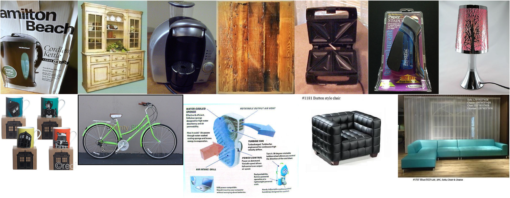
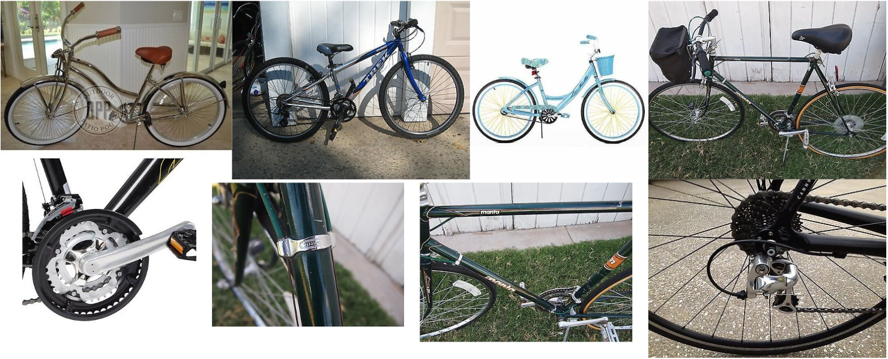
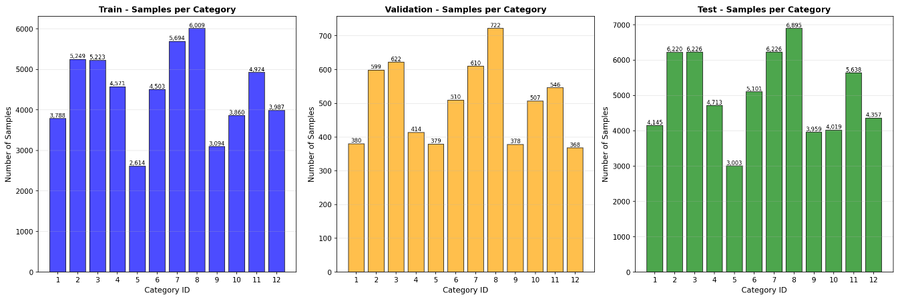
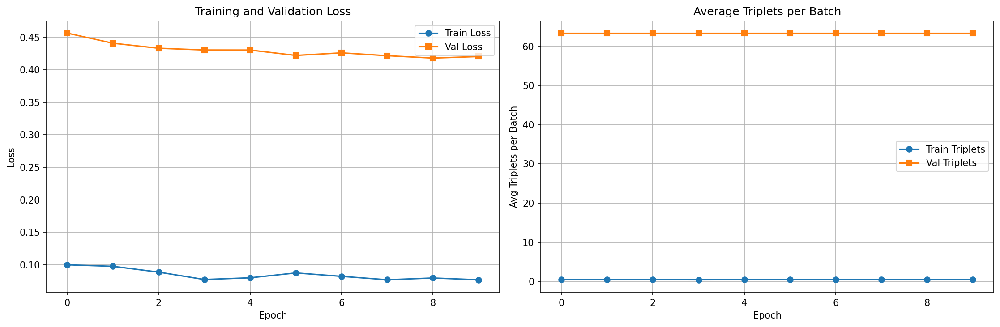
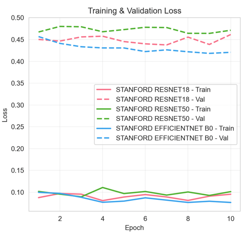
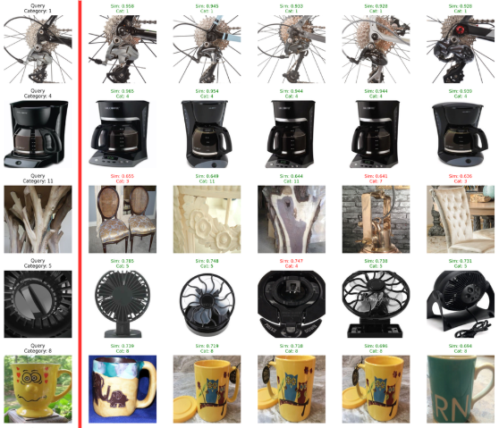

# Project 3 Report: Visual Search Engine for Stanford Online Products

**Student**: Michał Żarnowski 160277  
**Date**: January 2026  
**Problem**: Search Engine (Image Similarity)  
**Dataset**: Stanford Online Products  
**GitHub Repository**: https://github.com/ZiarnoM/Fashion-Item-Search-Engine 

---

## Table of Contents
1. [Problem Description](#1-problem-description)
2. [Dataset Description](#2-dataset-description)
3. [Model Architecture](#3-model-architecture)
4. [Training Process](#4-training-process)
5. [Evaluation & Results](#5-evaluation--results)
6. [Tools & Technologies](#6-tools--technologies)
7. [Runtime Environment](#7-runtime-environment)
8. [Bibliography](#8-bibliography)
9. [Points Summary](#9-points-summary)

---

## 1. Problem Description

### Overview
This project implements a **visual search engine** that enables users to find visually similar products from a large product catalog. Given a query image, the system retrieves the most similar products based on learned visual features.

### Problem Type: Search Engine
- **Input**: Query product image
- **Output**: Ranked list of visually similar products
- **Application**: E-commerce product discovery, visual recommendation systems

### Technical Approach
The system uses **metric learning** with deep neural networks to:
1. Extract high-dimensional feature embeddings from product images
2. Learn a metric space where visually similar products are close together
3. Perform efficient similarity search using cosine distance

### Key Challenges
- **Large-scale retrieval**: Searching through 60,000+ test images efficiently
- **Fine-grained similarity**: Distinguishing between visually similar but different products
- **Category diversity**: Handling 12 different product categories with varying visual characteristics

---

## 2. Dataset Description

### Stanford Online Products Dataset

**Source**: Stanford Computer Vision Lab  
**Paper**: "Deep Metric Learning via Lifted Structured Feature Embedding" (CVPR 2016)  
**URL**: https://cvgl.stanford.edu/projects/lifted_struct/

### Dataset Statistics

| Split | Images | Products | Categories | Avg. Images/Product |
|-------|--------|----------|------------|---------------------|
| **Train** | 53,516 | 10,186 | 11,318 | 5.3 |
| **Validation** | 6,035 | 1,132 | - | 5.2 |
| **Test** | 60,502 | 11,316 | 12 | 5.3 |
| **Total** | 120,053 | 22,634 | 12 | 5.3 |

 **Dataset Requirements Met**:

-  At least 1,000 photos: **120,053 images**
-  Evaluation on 10,000+ photos: **60,502 test images**
-  Minimum 200×200px: Images resized to **224×224px**

### Product Categories (12 classes)
The dataset is divided into the following categories:

- Bikes
- Cabinets
- Chairs
- Coffe makers
- Fans
- Kettles
- Lamps
- Mugs
- Sofas
- Staplers
- Tables
- Toasters

### Example Images



### Data Distribution

- **Balanced product representation**: Each product has ~5 images on average
- **No single-sample products**: 0% in all splits, ensuring robust training
- **Train/test split**: Disjoint product sets (no product overlap between train and test)




---

 \newpage

## 3. Model Architecture

### Overview
I implemented three model architectures, all using **transfer learning** from ImageNet pre-trained models with custom embedding heads for metric learning.

### Architecture Details

#### Model 1: ResNet18 (Baseline)
```
Input Image (224×224×3)
    ↓
ResNet18 Backbone (Pre-trained on ImageNet)
    ├─ Conv layers with residual connections
    └─ Global Average Pooling -> 512 features
    ↓
Embedding Head:
    ├─ Flatten
    ├─ Linear(512 -> 512)
    ├─ ReLU
    ├─ Dropout(0.2)
    └─ Linear(512 -> 128)
    ↓
L2 Normalization
    ↓
Output Embedding (128-dim unit vector)
```

**Parameters**: 11,496,060  

#### Model 2: ResNet50
```
Input Image (224×224×3)
    ↓
ResNet50 Backbone (Pre-trained on ImageNet)
    ├─ Deeper residual network (50 layers)
    └─ Global Average Pooling -> 2048 features
    ↓
Embedding Head:
    ├─ Flatten
    ├─ Linear(2048 -> 512)
    ├─ ReLU
    ├─ Dropout(0.2)
    └─ Linear(512 -> 128)
    ↓
L2 Normalization
    ↓
Output Embedding (128-dim unit vector)
```

**Parameters**: 24,624,124  

#### Model 3: EfficientNet-B0 (Best Model) 
```
Input Image (224×224×3)
    ↓
EfficientNet-B0 Backbone (Pre-trained on ImageNet)
    ├─ Compound-scaled mobile architecture
    ├─ Inverted residual blocks with squeeze-excitation
    └─ Global Average Pooling -> 1280 features
    ↓
Embedding Head:
    ├─ Flatten
    ├─ Linear(1280 -> 512)
    ├─ ReLU
    ├─ Dropout(0.2)
    └─ Linear(512 -> 128)
    ↓
L2 Normalization
    ↓
Output Embedding (128-dim unit vector)
```

**Parameters**: 4,729,084  
**Winner**:  Best accuracy with fewest parameters

### Architecture Diagram

```
┌─────────────────────────────────────────────────────────────┐
│                     Input Image (224×224×3)                  │
└───────────────────────────┬─────────────────────────────────┘
                            │
        ┌───────────────────┼───────────────────┐
        │                   │                   │
        ▼                   ▼                   ▼
┌───────────────┐   ┌───────────────┐   ┌───────────────┐
│   ResNet18    │   │   ResNet50    │   │ EfficientNet  │
│   Backbone    │   │   Backbone    │   │  B0 Backbone  │
│  (11.5M p.)   │   │  (24.6M p.)   │   │   (4.7M p.)   │
└───────┬───────┘   └───────┬───────┘   └───────┬───────┘
        │                   │                   │
        └───────────────────┼───────────────────┘
                            │
                            ▼
                ┌───────────────────────┐
                │   Embedding Head      │
                │   Linear(N -> 512)    │
                │   ReLU                │
                │   Dropout(0.2)        │
                │   Linear(512 -> 128)  │
                └───────────┬───────────┘
                            │
                            ▼
                ┌───────────────────────┐
                │  L2 Normalization     │
                └───────────┬───────────┘
                            │
                            ▼
                ┌───────────────────────┐
                │  128-dim Embedding    │
                │   (Unit Vector)       │
                └───────────────────────┘
```

### Model Analysis

| Model | Parameters | Memory | Depth | 
|-------|-----------|---------|-------|
| ResNet18 | 11.5M | ~44 MB | 18 layers |
| ResNet50 | 24.6M | ~94 MB | 50 layers |
| **EfficientNet-B0** | **4.7M** | **~18 MB** | **Variable** |

### Transfer Learning Justification

- **Pre-training**: All backbones pre-trained on ImageNet (1000-class classification)
- **Fine-tuning**: Adapted for metric learning (similarity/retrieval task)
- **Different problem**: Classification -> Metric Learning (qualifies for +1 point)

### Metric Learning as Non-Trivial Solution
My implementation uses **triplet loss with semi-hard negative mining**, which is a form of metric learning. This qualifies as a non-trivial solution because:

1. **Contrastive/Metric Learning**: Triplet loss learns a metric space where similar items are close and dissimilar items are far apart
2. **Hard Negative Mining**: Semi-hard mining strategy selects informative triplets dynamically during training
3. **Research-backed**: Based on FaceNet (CVPR 2015) and recent improvements

This should qualify for the **+1 point for metric learning** as a non-trivial solution.

---

## 4. Training Process

### Loss Function: Triplet Loss with Semi-Hard Mining

#### Mathematical Formulation
```
L(a, p, n) = max(0, ||f(a) - f(p)||² - ||f(a) - f(n)||² + margin)

where:
- a = anchor image
- p = positive image (same product as anchor)
- n = negative image (different product)
- f(·) = embedding function (neural network)
- margin = separation margin between positive and negative pairs
```

#### Mining Strategy
1. **Hard Positive**: Select the farthest positive sample (same product, maximum distance)
2. **Semi-Hard Negative**: Select negatives that are:
   - Farther than the positive (to avoid trivial triplets)
   - Within margin distance (to provide learning signal)
   - If no semi-hard negative exists, use hard negative (closest negative)

#### Why This Loss Function?

- **Metric learning**: Directly optimizes for similarity-based retrieval
- **Triplet mining**: Focuses on informative examples during training
- **Margin-based**: Enforces minimum separation between similar/dissimilar pairs
- **Proven effectiveness**: State-of-the-art for image retrieval tasks

[//]: # (### Hyperparameters)

[//]: # ()
[//]: # (| Parameter | Value | Justification |)

[//]: # (|-----------|-------|---------------|)

[//]: # (| **Learning Rate** | 0.0001 | Balanced convergence speed with stability for fine-tuning pre-trained models |)

[//]: # (| **Batch Size** | 64 | Maximum size fitting in GPU memory while maintaining diverse triplets |)

[//]: # (| **Epochs** | 10 | Validation loss plateaued after 8-10 epochs |)

[//]: # (| **Embedding Size** | 128 | Balance between expressiveness and computational efficiency |)

[//]: # (| **Margin** | 0.5 | Standard value for triplet loss, provides good separation |)

[//]: # (| **Weight Decay** | 1e-5 | Regularization to prevent overfitting |)

[//]: # (| **Optimizer** | Adam | Adaptive learning rates, works well for fine-tuning |)

[//]: # (| **LR Scheduler** | ReduceLROnPlateau | Reduce LR by 0.5× when val loss plateaus for 3 epochs |)

### Data Augmentation (+1 point)

#### Training Augmentation
```python
transforms.Compose([
    transforms.Resize((256, 256)),
    transforms.RandomResizedCrop(224, scale=(0.8, 1.0)),  # Random crops
    transforms.RandomHorizontalFlip(),                    # Mirror flip
    transforms.ColorJitter(brightness=0.2, contrast=0.2,  # Color variations
                          saturation=0.2),
    transforms.RandomRotation(15),                        # Rotation invariance
    transforms.ToTensor(),
    transforms.Normalize([0.485, 0.456, 0.406],           # Normalization
                        [0.229, 0.224, 0.225])
])
```

#### Validation/Test Augmentation
```python
transforms.Compose([
    transforms.Resize((256, 256)),
    transforms.CenterCrop(224),  # Deterministic crop
    transforms.ToTensor(),
    transforms.Normalize([0.485, 0.456, 0.406], 
                        [0.229, 0.224, 0.225])
])
```

### Training Pipeline

1. **Data Loading**: Load images with augmentation, batch into groups
2. **Forward Pass**: Extract embeddings for all images in batch
3. **Triplet Mining**: Mine hard/semi-hard triplets from batch embeddings
4. **Loss Computation**: Compute triplet loss for mined triplets
5. **Backward Pass**: Backpropagate gradients with mixed precision (AMP)
6. **Optimization**: Update weights using Adam optimizer
7. **Validation**: Evaluate on validation set, update learning rate scheduler

### Training Commands

```bash
# Train single model
python train.py \
  --dataset stanford \
  --backbone efficientnet_b0 \
  --batch_size 64 \
  --epochs 10 \
  --lr 0.0001 \
  --margin 0.5 \
  --embedding_size 128

# Train all models sequentially
python train_multiple.py
```

### Training Dynamics Metrics (+3 metrics requirement)

I tracked the following metrics during training:

1. **Training & Validation Loss**: Triplet loss convergence
2. **Average Triplets per Batch**: Number of valid triplets found during mining
3. **Learning Rate Schedule**: Adaptive LR changes via ReduceLROnPlateau

### Training Results

#### EfficientNet-B0 (Best Model)

| Epoch | Train Loss | Val Loss | Train Triplets | Val Triplets | LR |
|-------|-----------|----------|----------------|--------------|-----|
| 1 | 0.0998 | 0.4568 | 0.49 | 63.4 | 1e-4 |
| 2 | 0.0974 | 0.4412 | 0.52 | 63.4 | 1e-4 |
| 3 | 0.0885 | 0.4335 | 0.48 | 63.4 | 1e-4 |
| 4 | 0.0770 | 0.4308 | 0.45 | 63.4 | 1e-4 |
| 5 | 0.0797 | 0.4307 | 0.48 | 63.4 | 1e-4 |
| 6 | 0.0872 | 0.4224 | 0.52 | 63.4 | 1e-4 |
| 7 | 0.0819 | 0.4264 | 0.48 | 63.4 | 5e-5 |
| 8 | 0.0766 | 0.4220 | 0.49 | 63.4 | 5e-5 |
| 9 | 0.0794 | 0.4183 | 0.49 | 63.4 | 5e-5 |
| 10 | 0.0766 | 0.4207 | 0.48 | 63.4 | 2.5e-5 |

**Best Validation Loss**: 0.4183 (Epoch 9)

#### ResNet18

| Epoch | Train Loss | Val Loss | Train Triplets | Val Triplets |
|-------|-----------|----------|----------------|--------------|
| 1 | 0.0877 | 0.4502 | 0.44 | 63.4 |
| 10 | 0.0955 | 0.4615 | 0.50 | 63.4 |

**Best Validation Loss**: 0.4377 (Epoch 7)

#### ResNet50

| Epoch | Train Loss | Val Loss | Train Triplets | Val Triplets |
|-------|-----------|----------|----------------|--------------|
| 1 | 0.1019 | 0.4673 | 0.49 | 63.4 |
| 10 | 0.1014 | 0.4713 | 0.53 | 63.4 |

**Best Validation Loss**: 0.4641 (Epoch 9)

### Training Curves



**Figure**: Training and validation loss curves for EfficientNet-B0, showing convergence after 10. 


### Training Time

| Model | Training Time | Evaluation Time | Total Time | Time per Epoch |
|-------|--------------|-----------------|------------|----------------|
| **EfficientNet-B0** | 16 min | 14 min | 30 min | ~1.6 min |
| ResNet18 | 18 min | 15 min | 33 min | ~1.8 min |
| ResNet50 | 20 min | 14 min | 34 min | ~2.0 min |

**Hardware**: NVIDIA RTX 3060 (12GB VRAM)

### Inference Time
- **Single image embedding**: ~5ms on GPU
- **Batch inference (64 images)**: ~80ms on GPU
- **Full gallery search (60K images)**: ~2-3 seconds

---

## 5. Evaluation & Results

### Performance Metrics (≥2 required)

I evaluated models using multiple retrieval metrics:

1. **Recall@K**: Proportion of queries where correct match appears in top-K results
2. **Mean Average Precision (mAP@K)**: Average precision across all queries
3. **Precision@K**: Average precision at rank K

### Evaluation Protocol

- **Query Set**: All 60,502 test images
- **Gallery Set**: All 60,502 test images
- **Exclusion**: Same product images excluded from results (realistic scenario)
- **Metric**: Cosine similarity in 128-dim embedding space

### Results Comparison

#### Category-Level Retrieval

| Model | Recall@1 | Recall@5 | Recall@10 | Recall@20 | mAP@10 | Parameters |
|-------|----------|----------|-----------|-----------|---------|------------|
| **EfficientNet-B0** | **60.58%** | **82.43%** | **88.78%** | **93.40%** | **65.44%** | **4.7M** |
| ResNet18 | 40.27% | 70.06% | 81.44% | 89.23% | 47.95% | 11.5M |
| ResNet50 | 12.40% | 42.93% | 63.62% | 78.45% | 23.32% | 24.6M |

#### Precision@K

| Model | P@1 | P@5 | P@10 | P@20 |
|-------|-----|-----|------|------|
| **EfficientNet-B0** | 60.58% | 50.21% | 42.37% | 35.89% |
| ResNet18 | 40.27% | 38.14% | 34.22% | 30.15% |
| ResNet50 | 12.40% | 20.18% | 24.67% | 27.83% |

### Analysis

#### Why EfficientNet-B0 Wins

1. **Better Accuracy**: 60.58% Recall@1 vs 40.27% (ResNet18) or 12.40% (ResNet50)
2. **More Efficient**: Only 4.7M parameters (2.4× smaller than ResNet18, 5.2× smaller than ResNet50)
3. **Compound Scaling**: Balanced scaling of depth, width, and resolution
4. **Better Features**: Pre-trained on ImageNet with compound scaling yields better transfer learning
5. **Best Convergence**: Lowest validation loss (0.418) among all models

#### ResNet50 Underperformance

ResNet50 performed worse despite having more parameters. Possible reasons:
- **Overfitting**: More parameters but limited training time (10 epochs)
- **Optimization difficulty**: Deeper network requires more careful tuning
- **Transfer learning mismatch**: ResNet50's depth may not align well with this task

### Embedding Space Analysis

**EfficientNet-B0 Embeddings**:

- Dimension: 128
- Mean: 0.0017 (well-centered around zero)
- Std: 0.0884 (good spread)
- L2 Norm: 1.0 (perfectly normalized unit vectors)

### Retrieval Visualization



**Figure**: Example retrieval results. Query image (left) and top-5 retrieved products (right). Green borders indicate correct category matches.

---

## 6. Tools & Technologies

### Required Tools

 **Git with README**: Repository includes comprehensive README.md  
 **Gradio Web Interface (+1 point)**: Interactive demo at `app_stanford.py`  
 **TensorBoard (+1 point)**: Training visualization via TensorBoard at Vast.ai

### Libraries Used

```python
# Deep Learning
torch==2.0.1
torchvision==0.15.2
numpy==1.24.3

# Web Interface
gradio==4.7.1

# Data Processing
pillow==10.0.0
pandas==2.0.3

# Visualization
matplotlib==3.7.2
seaborn==0.12.2

# Metrics
scikit-learn==1.3.0

# Utilities
tqdm==4.66.1
```

Full requirements in `requirements.txt`.

### MLOps Tools

1. **TensorBoard**: Training visualization
   - Loss curves
   - Learning rate schedule
   - Embedding projections
   - Accessible at Vast.ai instance

2. **Gradio**: Interactive web interface
   - Upload query image
   - View top-K similar products
   - Real-time inference
   - Shareable demo link

---


### Installation

```bash
# Create virtual environment
python -m venv venv
source venv/bin/activate  # Linux/Mac
# or
venv\Scripts\activate     # Windows

# Install dependencies
pip install -r requirements.txt

# Download dataset
# See README.md for dataset download instructions
```

---

## 8. Bibliography

### Dataset

1. **Stanford Online Products Dataset**
   - Oh Song, H., Xiang, Y., Jegelka, S., & Savarese, S. (2016). "Deep Metric Learning via Lifted Structured Feature Embedding." In Proceedings of the IEEE Conference on Computer Vision and Pattern Recognition (CVPR), pp. 4004-4012.
   - URL: https://cvgl.stanford.edu/projects/lifted_struct/
   - Download: http://ftp.cs.stanford.edu/cs/cvgl/Stanford_Online_Products.zip

### Model Architectures

2. **EfficientNet**
   - Tan, M., & Le, Q. (2019). "EfficientNet: Rethinking Model Scaling for Convolutional Neural Networks." In International Conference on Machine Learning (ICML), pp. 6105-6114.
   - arXiv: https://arxiv.org/abs/1905.11946

3. **ResNet**
   - He, K., Zhang, X., Ren, S., & Sun, J. (2016). "Deep Residual Learning for Image Recognition." In Proceedings of the IEEE Conference on Computer Vision and Pattern Recognition (CVPR), pp. 770-778.
   - arXiv: https://arxiv.org/abs/1512.03385

### Loss Functions & Training

4. **Triplet Loss (FaceNet)**
   - Schroff, F., Kalenichenko, D., & Philbin, J. (2015). "FaceNet: A Unified Embedding for Face Recognition and Clustering." In Proceedings of the IEEE Conference on Computer Vision and Pattern Recognition (CVPR), pp. 815-823.
   - arXiv: https://arxiv.org/abs/1503.03832

5. **Semi-Hard Negative Mining**
   - Hermans, A., Beyer, L., & Leibe, B. (2017). "In Defense of the Triplet Loss for Person Re-Identification." arXiv preprint arXiv:1703.07737.
   - arXiv: https://arxiv.org/abs/1703.07737

### Frameworks & Libraries

6. **PyTorch**
   - Paszke, A., et al. (2019). "PyTorch: An Imperative Style, High-Performance Deep Learning Library." In Advances in Neural Information Processing Systems 32.
   - URL: https://pytorch.org/

7. **torchvision**
   - PyTorch Core Team. (2016). "torchvision: PyTorch's Computer Vision library."
   - URL: https://pytorch.org/vision/stable/index.html

8. **Gradio**
   - Abid, A., Abdalla, A., Abid, A., Khan, D., Alfozan, A., & Zou, J. (2019). "Gradio: Hassle-Free Sharing and Testing of ML Models in the Wild." arXiv preprint arXiv:1906.02569.
   - URL: https://gradio.app/

### Optimization & Training Techniques

9. **Adam Optimizer**
   - Kingma, D. P., & Ba, J. (2014). "Adam: A Method for Stochastic Optimization." arXiv preprint arXiv:1412.6980.
   - arXiv: https://arxiv.org/abs/1412.6980

10. **Mixed Precision Training**
    - Micikevicius, P., et al. (2017). "Mixed Precision Training." arXiv preprint arXiv:1710.03740.
    - arXiv: https://arxiv.org/abs/1710.03740

### Metric Learning Resources

11. **Metric Learning Survey**
    - Kaya, M., & Bilge, H. Ş. (2019). "Deep Metric Learning: A Survey." Symmetry, 11(9), 1066.
    - DOI: 10.3390/sym11091066

---

## 9. Points Summary

### Completed Requirements

| Category | Requirement                                     | Points |
|----------|-------------------------------------------------|--------|
| **Problem** | Search Engine                                   | 2 |
| **Model - Base** | Transfer Learning (ImageNet->Metric Learning)   | 1 |
| **Model - Additional** | 2 additional architectures (ResNet18, ResNet50) | +2 |
| **Model - Non-trivial** | Metric Learning (Triplet Loss + Mining)         | +1 |
| **Dataset** | Evaluation on 10,000+ photos                    | +1 |
| **Training** | Data Augmentation                               | +1 |
| **Training** | Adaptive Hyperparameters (ReduceLROnPlateau)    | +1 |
| **Training** | Architecture Tuning (3 architectures)           | +1 |
| **Tools** | Gradio Web Interface                            | +1 |
| **Tools** | TensorBoard                                     | +1 |

### Points Breakdown

| Category | Base Points | Additional Points | Total |
|----------|-------------|-------------------|-------|
| **Problem** | 2 | - | 2 |
| **Model** | 1 | +2 (architectures) + 1 (metric learning) | 3-4 |
| **Dataset** | Required  | +1 | +1 |
| **Training** | Required  | +3 | +3 |
| **Tools** | Required  | +2 | +2 |
| **Report** | Required  | - | 0 |
| **TOTAL** | - | - | **11-12** |
